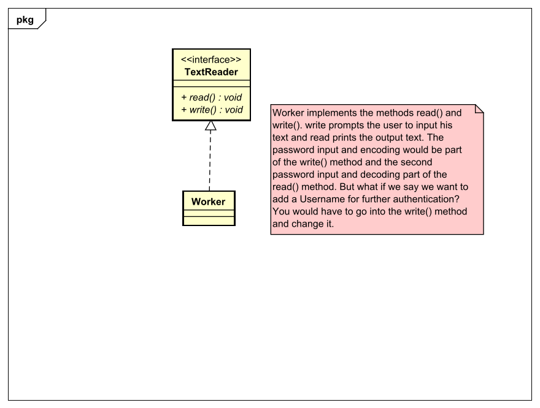
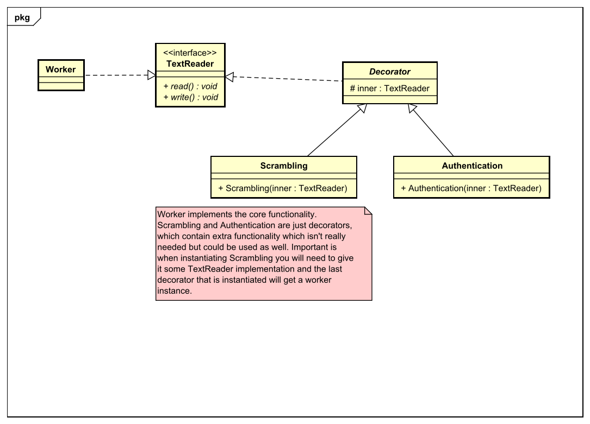

# Decorator Pattern
## Context
Im Decorator-Pattern zählt es den Code so aufzubauen, dass er beliebig oft erweiterbar ist, aber bereits
umgesetzter Code nicht verändert wird. Dabei gibt es eine abstrakte Klasse bzw. ein Interface, welches
die Funktionalitäten, die jeder Decorator selbst umsetzen soll beinhaltet. Dieses Interface implementiert
nur der Core sowie das Decorator-Interface/abstrakte Klasse. Diese Klasse beinhaltet ein Attribut,
welches den Decorator beinhaltet von dem die Klasse aufgerufen wurde. Dieses Attribut braucht der Core
nicht, denn in der Funktionalität wird solange die Funktionalität vom vorherigen Decorator aufgerufen
bis man zum Core gelangt.

## Problemdescription
Man will neue Funktionalität zur alten hinzufügen, ohne dabei konkrete Implementierungen zu verändern, stattdessen
erstellt man lieber neue Implementierungen. Nun könnte man die Funktionalität der alten Implementierung mit der neuen ergänzen und
das ganze in einer eigenen Implementierung schreiben.

Als Beispiel nehme ich das im Unterricht ausgearbeitete [TextReader Beispiel](https://github.com/TGM-HIT/sew4-decorator-textreader-lhalbritter-tgm).
In diesem ging es darum, einen vom User eingegebenen Text mit einem Passwort zu verschlüsseln und wenn man das Passwort dann eingibt
wird der Text entschlüsselt ausgegeben. Dieses sollte mit dem Decorator Pattern realisiert werden. Der erste Ansatz wäre
diese Abfolge in einer Klasse zu verwirklichen.

Wie im UML Diagramm beschrieben, ist es mit diesem Prinzipt mühsam die Funktionalität zu erweitern.

## Solution
Die Lösung ist eine Kern-Funktionalität zu bestimmen, die auf jeden Fall ausgeführt wird und zusätzliche Funktionalität mithilfe
von neuen Implementierungen hinzuzufügen.

Das heißt beim TextReader sucht man sich die Kern-Funktionalität - in dem Fall der Input des Users und der Output des entschlüsselten
Textes - und trennt diesen von zusätzlicher Funktionalität. Wichtig bei jeder Implementierung ist, dass sie auf jeden Fall
die Methode der vorherigen Implementierung aufruft, damit man irgendwann zur Kern-Funktionalität kommt.

See the code for this example [here](src/main/java/decorator/textreader)

## Next up
[Factory Design Pattern - Simple](../factory/simple/README.md)

[Overview page](../../README.md)