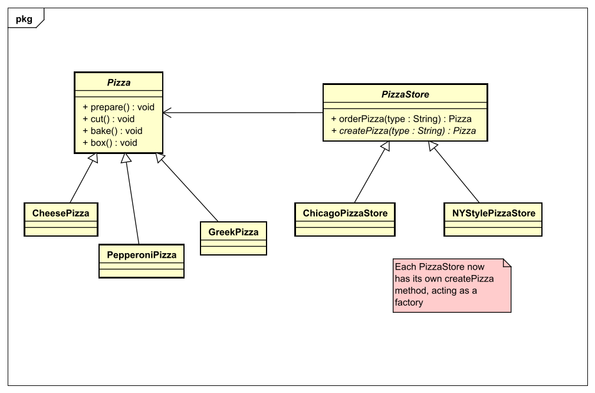
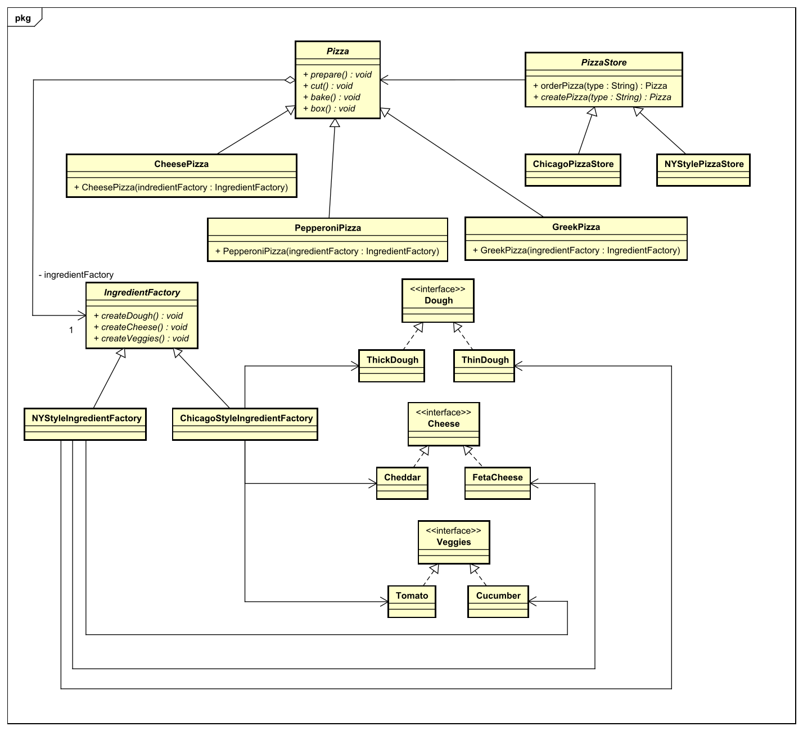

# Factory Pattern - Abstract
## Context
Das abstract factory Prinzip kümmert sich darum, dass jede konkrete Implementierung einer Hauptklasse selbst entscheiden kann,
welche konkrete Implementierung der Factory sie nutzt, denn wie der Name bereits sagt, ist die Factory-Klasse nun abstrakt.

## Problemdescription
Wenn man die factory method umgesetzt hat, wird man draufkommen wenn man noch mehr unterschiedliche Implementierungen hat,
dass man sehr viel in der factory method auch ändern muss.

## Solution
Darum sollte man lieber gleich die Factory-Klasse abstrakt machen, damit man statt Code zu ändern einfach eine neue
konkrete Factory hinzufügen kann und somit unterschiedliche Funktionalität hervorrufen kann.

Im PizzaStore Beispiel wollen wir nun hinzufügen, dass jede Pizza eigene Arten von Zutaten braucht.

See the code for this example [here](src/main/java/abstract_factory/pizza)

## You're done!

[Overview page](../../../README.md)