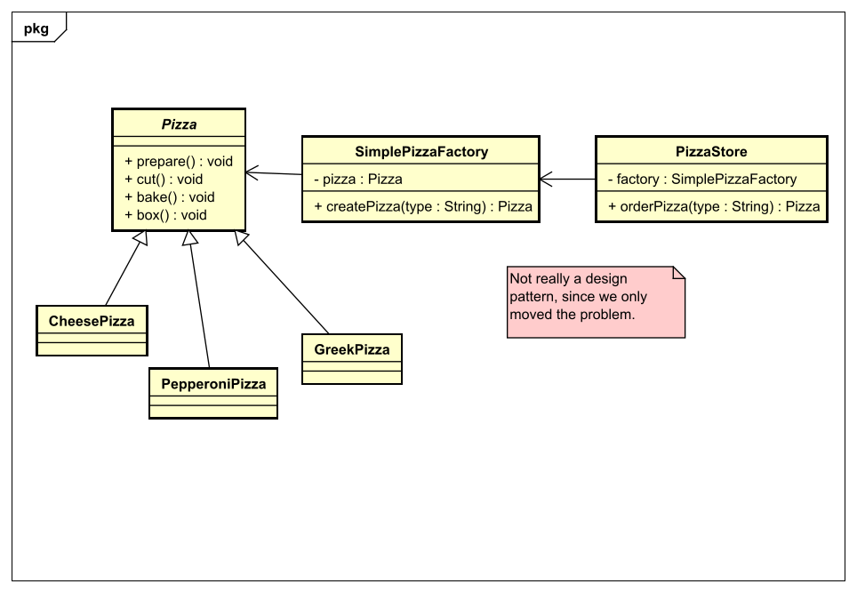

# Factory Pattern - Method
## Context
Die factory method kümmert sich darum, dass die Implementierungen der Hauptklasse
entscheiden können, wie sie die create bzw. factory Methode umsetzen. Die Implementierungen haben also
eine eigene Methode, die als ihre Factory agiert.

## Problemdescription
Nachdem man nun die simple factory umgesetzt hat, haben wir letztendlich das Problem
nur verschoben. Die Hauptklasse hat also nun eine Factory mit der sie
ihre gewünschte Implementierung bekommt, aber was ist wenn es verschiedene Implementierungen
der Hauptklasse gibt und jede Implementierung verschiedene factories braucht.

## Solution
Dabei hilft die Factory Method aus, bei dieser macht man die Hauptklasse und deren create Methode abstrakt,
so dass jede Implementierung nicht von einer Factory abhängt sondern deren create Methode
als factory nutzen kann.

See the code for this example [here](src/main/java/method/pizza)

## Next up
[Factory Pattern - Abstract](../abstract/README.md)

[Overview page](../../../README.md)