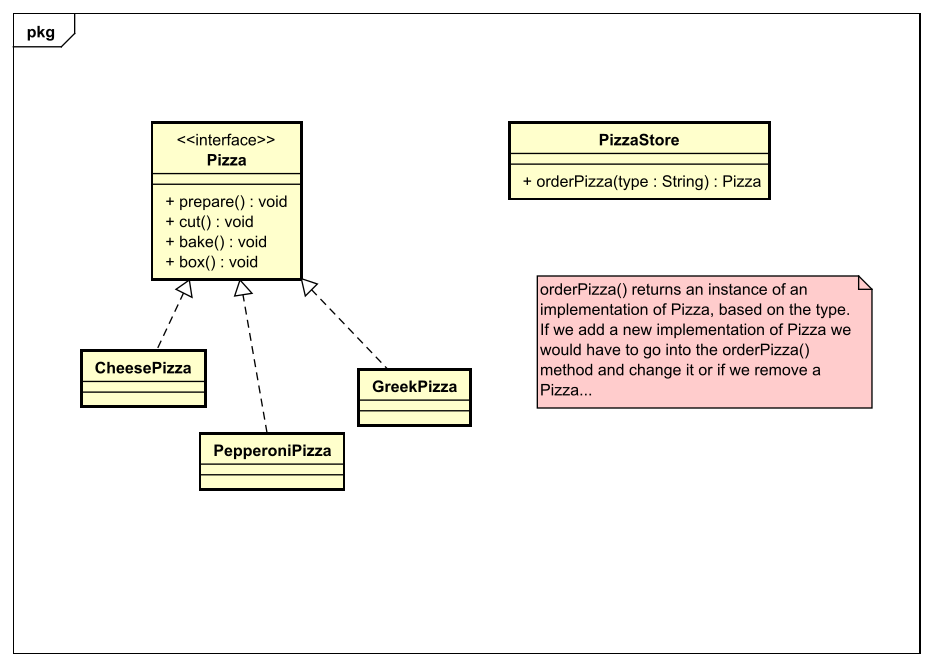

# Factory Pattern - Simple
## Context
Es geht wieder darum Veränderungen in Code zu verhindern. Die einfache factory
kümmert sich darum, dass in der Hauptklasse kein Code verändert werden muss,
sondern nur in der Factory Klasse.

## Problemdescription
Wenn es mehrere Implementierungen zu etwas gibt und man möchte jede in einer Art
nutzen, muss man für jede neu implementierte Klasse den Code verändern.

## Solution?
Die einfache Factory ist eigentlich keine wirkliche Lösung, sie verschiebt
im Prinzip den veränderlichen Code einfach nur in eine andere Klasse, in
dem Fall in eine Factory-Klasse. Im Grunde ist das Prinzip von Factory Patterns
den new Operator so weit wie möglich von der Funktionalität zu entfernen.

See the code for this example [here](src/main/java/simple/pizza)

## Next up
[Factory Pattern - Method](../method/README.md)

[Overview page](../../../README.md)