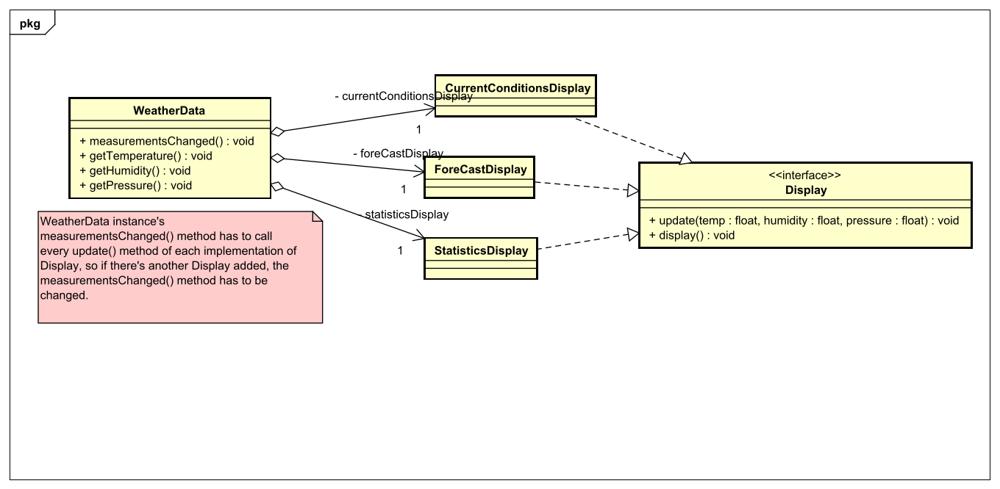
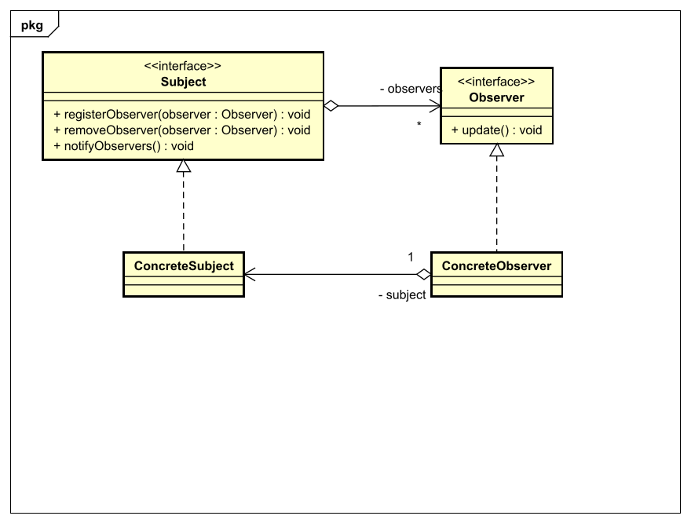
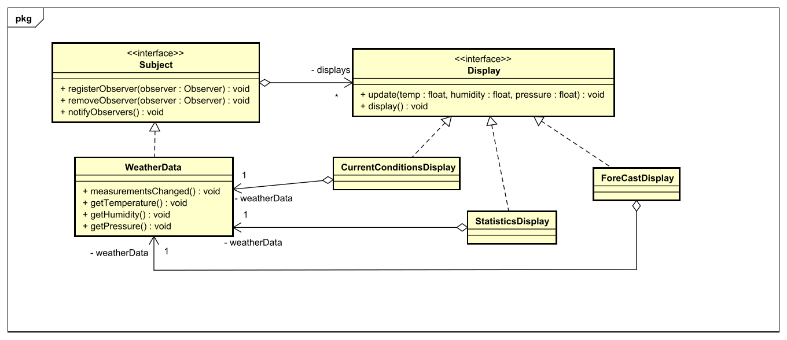

# Observer Pattern
## Context
Das Observer Pattern beschreibt eines der Design Patterns in der Softwareentwicklung.
Im Observer Pattern geht es um die Kommunikation mehrerer Teilnehmer. Es gibt hierbei die Subjects,
welche Daten zur Verfügung stellen und die Observer, welche ihre Daten von den Subjects bekommen (push) oder sich holen (pull).
Das Subject informiert jeden Observer, der bei ihm registriert ist, wenn es Änderungen der Daten gibt.
Der Observer bekommt dann entweder die Daten, indem das Subject sie mitsendet oder indem er sich sie selbst holt.


## Problemdescription
Man hat eine Klasse die Daten zur Verfügung stellt und mehrere Klassen, die die Daten dauerhaft
aktualisiert haben wollen. Also müssten die Klassen immer wieder die Datenklasse abfragen, ob sich
nicht etwas an den Daten geändert hat. Stattdessen sagt die Datenklassen jeder dieser Klassen,
wenn sich etwas geändert hat.

Ich nehme hier als Beispiel das WeatherData Beispiel von [Head First Design Patterns - Observer](https://www.javaguides.net/2018/07/observer-pattern-from-head-first-design-patterns.html)



Wie im obigen Diagramm zu sehen, müsste man die ```measurementsChanged();``` Methode bei jeder neu
implementierten Klasse von ```Display``` immer wieder neu anpassen und das widerspricht
dem Prinzip der Kapselung.

## Solution
Die Lösung ist die Datenklasse so umzuschreiben, dass sich jede Implementierung der Abfrageklasse
bei dieser Datenklasse registrieren kann und ihr so sagen kann, dass sie von jeder Änderung mitbekommen will.
Die Datenklasse speichert jede registrierte Instanz in einem Attribut (meist eine Liste). 


Allgemeine Lösung für Observer Pattern im pull Prinzip

Angewandt auf das WeatherData Beispiel könnte das UML Diagramm so aussehen.



Nun kann man nach belieben Implementierungen von ```Display``` hinzufügen
und muss diese nur bei ```WeatherData``` registrieren.

### Unterschied Pull & Push Prinzip
Die allgemeine Lösung des Observer Patterns ist im pull Prinzip designed, das heißt, dass das Subject die Observer nur
benachrichtigt, dass sich die Daten geändert haben und die Observer sich diese dann selbst holen. Das UML zu unserem Beispiel
ist im push Prinzip designed, das heißt das Subject benachrichtigt nicht nur die Observer, sondern sendet ihnen alle Daten mit.
Der Vorteil vom pull Prinzip gegenüber dem push Prinzip ist, dass sich die Observer nur die Daten holen können, die sie auch
brauchen, im push Prinzip wird einfach alles mitgegeben, egal was der Observer braucht.

See the code for this example [here](src/main/java/observer/weather)

## Next up
[Decorator Design Pattern](../decorator/README.md)

[Overview page](../../README.md)