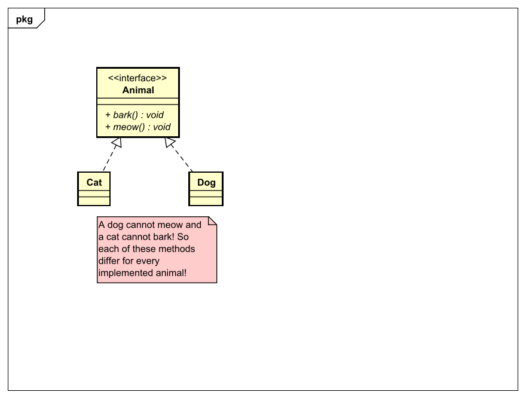
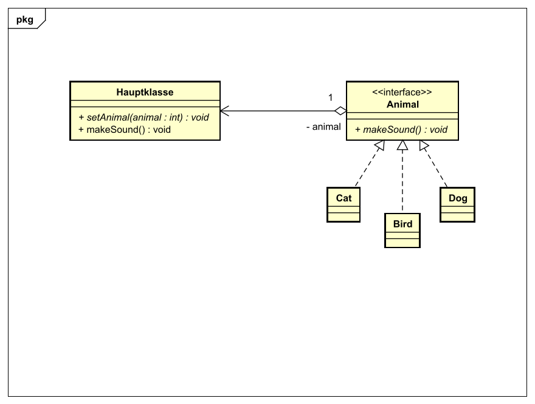

# Strategy Pattern
## Context
Im Strategy Design Pattern geht es darum, veränderbaren Code von Code, der nicht verändert werden sollte
zu entkapseln.

The strategy design pattern's main principle is the encapsulation of
changing code and code that should not be changed anymore.

## Problemdescription
Man hat mehrere Klassen, die gleichen Code haben und nur wenig Funktionalität unterscheidet sich,
je nachdem um welche Implementierung es sich handelt.
Nun müsste man für jede dieser Klassen immer wieder den gleichen Code schreiben,
aber das was sich unterscheidet eben für jede individuell schreiben.

In diesem Beispiel wollen wir mehrere Tiere haben, die entweder bellen, quaken, miauen, etc.
Wenn man wie im unten zu sehenden UML-Diagramm ein Interface dafür macht, müsste jede
Implementierung von ```Animal``` auch ```bark();``` bzw. ```meow();``` implementieren,
obwohl ein Hund z.B. gar nicht Miaut.

You have many classes which contain the same base methods but with 
less functionality that differs. You would have to write the same code again
for every class and only differ the one functionality that differs.



## Solution
Die Lösung ist alles, das sich je Klasse unterscheidet wegzunehmen und
eigene Implementierungen für diese Verhalten zu schreiben. Die Hauptklasse
hat nun nur noch Code der sich niemals verändert, nur die Verhalten verändern sich
je nach Implementierung.

Sprich fasst man bei unserem Beispiel einfach die Methoden ```bark();``` und ```meow();``` zu
```makeSound();``` zusammen und implementiert diese Methode bei jeder Implementierung
passend dazu. In der Hauptklasse muss also nur noch das Tier gesetzt werden mit der Methode
```setAnimal();``` und man bekommt mit einem Aufruf von ```makeSound();``` den gewünschten Laut. Der
Vorteil dabei ist, dass es erweiterbar ist, ohne den Code der Hauptklasse zu ändern,
man fügt jediglich eine weitere Implementierung von ```Animal``` hinzu.

The solution for this is to take everything that differs and write own implementations for each individual behaviour.
The main class should only contain code, which never differs, only the behaviour differs depending on the implementation.



See the code for this example [here](src/main/java)

## Next up
[Observer Design Pattern](../observer/README.md)

[Overview page](../../README.md)